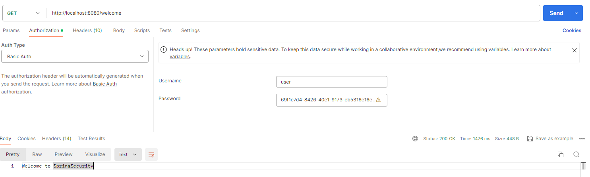

The key concepts of spring security:
------------------------------------

1. Request->AuthenticationFilter->AuthenticationManager-AuthenticationProvider(UserDetailsService,PasswordEncoder)
2. SecurityContext(**AuthenticationSuccessHandler**) - AuthenticationFailureHandler
3. AuthenticationFilter is the only **class** - > Remaining all are **interfaces**(Default impl provided by spring security)
4. If the use login successful-next time onwards it will take it from SecurityContext
5. if you want to customize security - extends **WebSecurityConfigurerAdapter**
6. UserDetailsService- (**InMemoryUserDetailsManager**,LDAP..)
7. if we want to implement own authentication provider - implements **AuthenticationProvider**
8. When we add spring-security dependency - by default **basic authentication** will be provided
9. UserDetailsService impl responsibility- to create the user called user and generate the password(UUID-universal unique identifier) and stores in the memory - if restarts new password will be generated
10. When we start the application SpringContext will be loaded.

Testing:
--------
1. Test from postman after adding spingsecurity dependency(Go to authorization tab -> security type- > basic Auth)
2. Default password encode will not encode the password it uses plain password
3. Once the login successful , it stores the user information in the security context and generates the **JSESSIONID** and stores in the **SecurityContext**
4. From next request onwards,it uses info from the security context.
5. Next request onwards, browser will send the **cookie** in the request.(Check in the post man **rights-ide cookies** section.)
6. Remove cookie and then send the request - then it will not work, need to provide login details again

spring 2.x  vs spring 3.0
-------------------------

**Before spring 3.0**
1. Need to extend **WebSecurityConfigurerAdapter** and override **configure**() method.

**After 3.0**

1. Create class and annotate with **@Configuration**  and create a Bean with **SecurityFilterChain**
2. Check spring 3.0 vs spring3.2 - **SecurityFilterChain** - configuration

From 3.2: Creating Custom Security Configuration
-------------------------------------------------
`
    
    @Configuration
    public class CustomSecurityConfig {

    @Bean
    SecurityFilterChain filterChain(HttpSecurity http) throws Exception {

        System.out.println("================Creating SecurityFilterChain Object.=================");
        http.httpBasic(Customizer.withDefaults());
        http.authorizeHttpRequests(authorize->authorize.anyRequest().authenticated());
        return http.build();
    }
}
`

Custom UserDetailsService:
--------------------------

1. In spring security,all passwords should be encoded, and it should use password encoder.
2. It will not generate default password in the console.

`

    @Bean
    UserDetailsService userDetailsService(){
    //It's default Implementation for UserDetailsService
    InMemoryUserDetailsManager inMemoryUserDetailsManager=new InMemoryUserDetailsManager();

        //Create UserDetails with username and password
        //every user has atleast one authority
        UserDetails userDetails =User.withUsername("test").password("12345").authorities("read").build();
        inMemoryUserDetailsManager.createUser(userDetails);
        return inMemoryUserDetailsManager;
    }
`
3. If we don't use PasswordEncoder, **IllegalArgumentException**: You have entered a password with no PasswordEncoder. 
4. If that is your intent, it should be prefixed with `{noop}`

`
    
    @Bean
    UserDetailsService userDetailsService(){

        System.out.println("========Creating UserDetailsService==========");
        //It's default Implementation for UserDetailsService
        InMemoryUserDetailsManager inMemoryUserDetailsManager=new InMemoryUserDetailsManager();

        //Create UserDetails with username and password
        //every user has at least one authority

        //UserDetails userDetails =User.withUsername("test").password("12345").authorities("read").build();
        UserDetails userDetails =User.withUsername("test").password(passwordEncoder().encode("12345")).authorities("read").build();
        inMemoryUserDetailsManager.createUser(userDetails);
        return inMemoryUserDetailsManager;
    }

    @Bean
    BCryptPasswordEncoder passwordEncoder(){
        return new BCryptPasswordEncoder();
    }
`

Custom Authentication Provider:
-------------------------------
- no need of UserDetailsService and PasswordEncoder
- implement **AuthenticationProvider**
- **AuthenticationManager** passes **UsernamePasswordAuthenticationToken** in the **authentication** object and to see whether CustomAuthenticationProvider supports UsernamePasswordAuthenticationToken or not.
- Comment `UserDetailsService userDetailsService(){}` if we use Custom Authentication Provider.

Form Based Authentication:
---------------------------
- `http.formLogin(Customizer.withDefaults());`
- `http.authorizeHttpRequests(authorize->authorize.**requestMatchers("/welcome")**.authenticated());`
-  OR `http.authorizeHttpRequests(authorize->authorize.requestMatchers("/welcome").authenticated()
   //deny all other requests
   .anyRequest().denyAll()//optional
   );`

Custom Filters:
---------------
- If we use formBased authentication , then spring security uses  FormbasedAuthentication filter.
- If we use basicAuth, then spring security uses  BasicAuthentication filter.
- If we use CSRF, then it used CSRF related filter
- We can add the filter before or after any filter.

`http.httpBasic(Customizer.withDefaults());
http.authorizeHttpRequests(authorize->authorize.requestMatchers("/welcome").authenticated());
http.addFilterBefore(new CustomSecurityFilter(), BasicAuthenticationFilter.class);`

GenericFilterBean:
------------------
- to read init parameters from web.xml , then extend **GenericFilterBean** and use setter methods to injct values from web.xml init parameters. 

OncePerRequestFilter:
----------------------
- to execute filter per request then extend **OncePerRequestFilter**